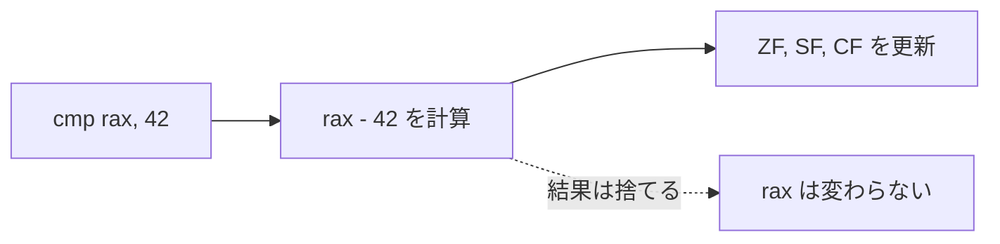
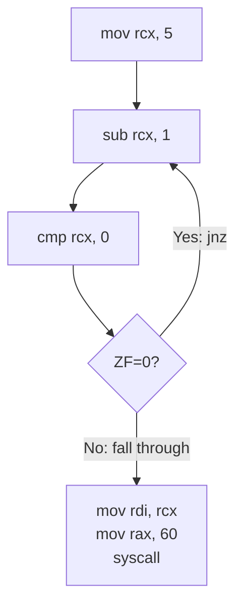

`v2` は条件分岐です。
ここで CPU は「常に次へ進む」だけではなく、状態を見て次の命令位置を選ぶようになります。

## 概要

`cmp` は値を保持せず、フラグだけを更新します。そこから `jz`/`jnz`/`jg` へつながる点がこの段階の核心です。
ループと条件分岐の両方を扱い、RIP が非線形に変化する様子を観察します。

## この段階で押さえること

- `cmp` は値を書き換えず flags を更新する
- 分岐は flags を読んで次の `RIP` を決める
- ループは「比較 → 条件ジャンプ」の繰り返しで実現される
- 制御フローは「計算結果の使い道」

## AT&T 記法と Intel 記法

アセンブリには同じ x86-64 でも複数の表記流儀があります。代表的なのが **AT&T 記法** と **Intel 記法** です。

| 項目 | Intel 記法 | AT&T 記法 |
|------|-----------|-----------|
| オペランド順 | `mov rax, rbx` | `movq %rbx, %rax` |
| レジスタ | `rax` | `%rax` |
| 即値 | `42` | `$42` |
| メモリ | `[rax]` | `(%rax)` |

本教材は **NASM + Intel 記法** を使います。理由は、教科書的な表記や Intel SDM と対応を取りやすく、初学者が「どこへ何を書き込むか」を左から右へ読みやすいからです。

逆に Linux の古い資料や `objdump -d`、GAS 系の文脈では AT&T 記法が出てきます。今後資料を読むときに混乱しやすい点は、**オペランド順が逆** だということです。Intel の `cmp rax, 42` は「`rax - 42` を計算して flags を更新する」ですが、AT&T では `cmpq $42, %rax` と書きます。

## cmp 命令

`cmp` は減算を行いますが、その結果を捨て、フラグだけを更新します。

```
cmp rax, 42
```

この命令は内部で `rax - 42` を計算します。結果が 0 なら ZF（Zero Flag）が 1 になり、結果が負なら SF（Sign Flag）が 1 になります。しかし `rax` の値は変わりません。

つまり `cmp` は `sub` と同じ計算をしながら、レジスタへの書き戻しだけを省略した命令です。



## 条件ジャンプ

`cmp` で設定されたフラグを読み、次に実行する命令のアドレス（RIP）を決めるのが条件ジャンプです。

| 命令 | 意味 | 条件 |
|------|------|------|
| `jz` / `je` | Jump if Zero / Equal | ZF=1 |
| `jnz` / `jne` | Jump if Not Zero / Not Equal | ZF=0 |
| `jg` / `jnle` | Jump if Greater | ZF=0 かつ SF=OF |
| `jl` / `jnge` | Jump if Less | SF!=OF |
| `jmp` | 無条件ジャンプ | 常にジャンプ |

`jmp` はフラグを見ずに常にジャンプします。条件分岐の後に「そうでない場合」の処理を飛ばすために使います。

## ラベル

ジャンプ先のアドレスに名前をつけるのがラベルです。

```nasm
.equal:
    mov rdi, 0
```

ドットで始まるラベル（`.equal`）はローカルラベルと呼ばれ、直前のグローバルラベル（`_start`）のスコープ内で有効です。アセンブラがラベルを実際のアドレスに変換してくれるので、プログラマは数値アドレスを覚える必要がありません。

## ループの仕組み

countdown でループの基本パターンを見てみます。

```
1. カウンタを初期化する（mov rcx, 5）
2. カウンタを減らす（sub rcx, 1）
3. カウンタが 0 か比較する（cmp rcx, 0）
4. 0 でなければ 2 に戻る（jnz .loop）
5. 0 なら終了
```



このパターンは C の `while` や `for` ループの本質と同じです。高級言語のループは最終的にこの「比較 → 条件ジャンプ」に変換されます。

## RIP が非線形に変化する

v1 では RIP は常に増加していました。v2 で初めて RIP が「戻る」動きをします。

### countdown の RIP 遷移

| ステップ | 命令 | rcx | RIP の動き |
|----------|------|-----|-----------|
| 1 | `mov rcx, 5` | 5 | 順方向 |
| 2 | `sub rcx, 1` | 4 | 順方向 |
| 3 | `cmp rcx, 0` | 4 | 順方向 |
| 4 | `jnz .loop` | 4 | **後方ジャンプ（ステップ2へ）** |
| 5 | `sub rcx, 1` | 3 | 順方向 |
| 6 | `cmp rcx, 0` | 3 | 順方向 |
| 7 | `jnz .loop` | 3 | **後方ジャンプ** |
| ... | ... | ... | ... |
| | `jnz .loop` | 0 | フォールスルー（順方向） |

GDB で `stepi` を繰り返しながら `info registers rip` を見ると、RIP が同じアドレス範囲を何度も通過する様子が観察できます。

### max の RIP 遷移

| ステップ | 命令 | 説明 |
|----------|------|------|
| 1 | `mov rax, 15` | 順方向 |
| 2 | `mov rbx, 27` | 順方向 |
| 3 | `cmp rax, rbx` | 15 < 27 なので SF=1 |
| 4 | `jg .rax_greater` | SF!=OF なので**フォールスルー** |
| 5 | `mov rdi, rbx` | rbx(27) を exit code に |
| 6 | `jmp .exit` | **前方ジャンプ**（.rax_greater を飛ばす） |

## ソースコード

{{code:asm/cmp_equal.asm}}

{{code:asm/countdown.asm}}

{{code:asm/max.asm}}

## 参考文献

本章の技術的記述は以下の一次資料に基づいています。

- [Intel SDM Vol.2 CMP](https://www.felixcloutier.com/x86/cmp) — `temp := SRC1 - SignExtend(SRC2)` で結果を捨てフラグのみ更新
- [Intel SDM Vol.2 Jcc](https://www.felixcloutier.com/x86/jcc) — 条件ジャンプの一覧: JZ(ZF=1), JNZ(ZF=0), JG(ZF=0∧SF=OF), JL(SF≠OF)
- [Intel SDM Vol.2 JMP](https://www.felixcloutier.com/x86/jmp) — 無条件ジャンプ
- [NASM Manual §3.9 "Local Labels"](https://www.nasm.us/doc/nasmdoc3.html) — ドット接頭辞によるローカルラベルの仕組み
