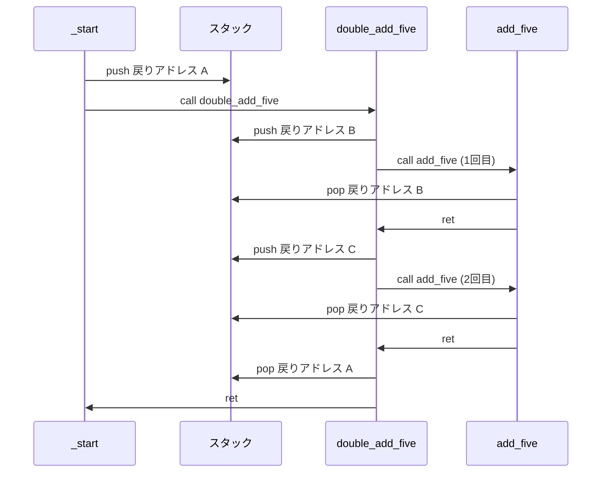

`v4` では「関数を呼ぶ」とは CPU の中で何が起きることなのかを扱います。
その中心にあるのが **スタック** と **call/ret** です。

## 概要

`v4` はスタックと call/ret を扱います。
push/pop でスタックへの値の出し入れを行い、call/ret で関数呼び出しと復帰の仕組みを学びます。
ネストした関数呼び出しでは、戻りアドレスがスタックに積み重なる様子を観察します。

## 命令の動作と呼び出し規約は別物

`call` / `ret` の説明を読むときに混同しやすいのが、**命令そのものの動作** と **ABI（呼び出し規約）** の違いです。

- **命令の動作** — `call` は戻りアドレスを積んでジャンプし、`ret` は戻りアドレスを取り出して戻る
- **呼び出し規約** — 引数をどのレジスタに入れるか、どのレジスタを保存する責任がどちらにあるか、といったソフトウェア側の約束

たとえば System V AMD64 ABI では整数引数を `rdi`, `rsi`, `rdx`, `rcx`, `r8`, `r9` に入れる慣習がありますが、CPU の `call` 命令自体はそのことを知りません。CPU が保証するのは「戻り先アドレスをスタックへ積む」ことだけです。この区別を押さえると、後で libc やコンパイラが出てきても整理しやすくなります。

## スタック — LIFO データ構造

スタックは **LIFO（Last In, First Out: 後入れ先出し）** のデータ構造です。
x86-64 では、スタックはメモリの **高アドレスから低アドレスに向かって伸びます**。
つまり値を積む（push する）と、スタックポインタの値は **減少** します。

```
高アドレス
┌──────────┐
│          │  ← スタックの底（プログラム開始時の rsp）
├──────────┤
│  値 A    │  ← 最初に push された値
├──────────┤
│  値 B    │  ← 次に push された値（rsp はここを指す）
└──────────┘
低アドレス
```

## rsp（スタックポインタ）

`rsp` レジスタはスタックの **先頭（top）** を指します。

- `push` すると rsp は **8 減る**（64 ビット = 8 バイト分）
- `pop` すると rsp は **8 増える**

| 操作 | rsp の変化 | 説明 |
|------|-----------|------|
| `push rax` | rsp -= 8 | rax の値をスタックに積む |
| `pop rax` | rsp += 8 | スタックから値を取り出して rax に入れる |

## push/pop の動作

`push` と `pop` は、それぞれ以下の操作と等価です。

### push rax

```
rsp -= 8          ; スタックポインタを 8 バイト下げる
[rsp] = rax       ; rsp が指す位置に rax の値を書き込む
```

### pop rax

```
rax = [rsp]       ; rsp が指す位置の値を rax に読み込む
rsp += 8          ; スタックポインタを 8 バイト上げる
```

### push_pop.asm の状態遷移

| ステップ | 命令 | rax | rbx | rcx | rdx | rsp の変化 | スタック内容 |
|---------|------|-----|-----|-----|-----|-----------|------------|
| 1 | `mov rax, 10` | 10 | - | - | - | 変化なし | [] |
| 2 | `mov rbx, 20` | 10 | 20 | - | - | 変化なし | [] |
| 3 | `push rax` | 10 | 20 | - | - | rsp -= 8 | [10] |
| 4 | `push rbx` | 10 | 20 | - | - | rsp -= 8 | [10, 20] |
| 5 | `pop rcx` | 10 | 20 | **20** | - | rsp += 8 | [10] |
| 6 | `pop rdx` | 10 | 20 | 20 | **10** | rsp += 8 | [] |

LIFO なので、最後に push した `rbx`（20）が最初に pop されます。

## call/ret — 関数呼び出しの仕組み

### call label

`call` は以下の 2 つの操作を 1 命令で行います。

```
push rip          ; 次の命令のアドレス（戻りアドレス）をスタックに積む
jmp label         ; label へジャンプする
```

### ret

`ret` は `call` の逆操作です。

```
pop rip           ; スタックから戻りアドレスを取り出して rip に入れる
```

これにより、関数が終了すると `call` の次の命令に戻ることができます。

### call_ret.asm の状態遷移

| ステップ | 命令 | rdi | rsp の変化 | rip | スタック内容 |
|---------|------|-----|-----------|-----|------------|
| 1 | `mov rdi, 10` | 10 | 変化なし | _start+N | [] |
| 2 | `call add_five` | 10 | rsp -= 8 | add_five | [戻りアドレス] |
| 3 | `add rdi, 5` | **15** | 変化なし | add_five+N | [戻りアドレス] |
| 4 | `ret` | 15 | rsp += 8 | _start+M | [] |
| 5 | `mov rax, 60` | 15 | 変化なし | _start+M+N | [] |

## ネストした関数呼び出し

関数の中からさらに別の関数を呼ぶと、**戻りアドレスがスタックに積み重なります**。



### nested_calls.asm の状態遷移

| ステップ | 命令 | rdi | スタック内容 |
|---------|------|-----|------------|
| 1 | `mov rdi, 3` | 3 | [] |
| 2 | `call double_add_five` | 3 | [retA] |
| 3 | `call add_five` (1回目) | 3 | [retA, retB] |
| 4 | `add rdi, 5` | **8** | [retA, retB] |
| 5 | `ret` (add_five) | 8 | [retA] |
| 6 | `call add_five` (2回目) | 8 | [retA, retC] |
| 7 | `add rdi, 5` | **13** | [retA, retC] |
| 8 | `ret` (add_five) | 13 | [retA] |
| 9 | `ret` (double_add_five) | 13 | [] |

最終的に rdi は 3 + 5 + 5 = 13 になります。

## GDB でスタックを観察する

GDB の `x` コマンドでスタックの中身を直接覗くことができます。

```
x/4xg $rsp
```

- `4` — 4 個分表示
- `x` — 16 進数で表示
- `g` — giant word（8 バイト = 64 ビット単位）

例えば `push rax`（rax = 10）の直後に実行すると:

```
0x7fffffffe000:  0x000000000000000a    ← 10 (rax の値)
```

`info registers rsp` で現在の rsp の値を確認しつつ、`x/Nxg $rsp` でスタック内容を表示することで、push/pop や call/ret の動作を一歩ずつ追うことができます。

## ソースコード

### push_pop.asm

{{code:asm/push_pop.asm}}

### call_ret.asm

{{code:asm/call_ret.asm}}

### nested_calls.asm

{{code:asm/nested_calls.asm}}

## 参考文献

本章の技術的記述は以下の一次資料に基づいています。

- [Intel SDM Vol.1 §6.2 "Stacks"](https://www.intel.com/content/www/us/en/developer/articles/technical/intel-sdm.html) — スタックは高アドレスから低アドレスへ伸びる
- [Intel SDM Vol.2 PUSH](https://www.felixcloutier.com/x86/push) — RSP を 8 デクリメントしてからオペランドを書き込む（64-bit モード）
- [Intel SDM Vol.2 POP](https://www.felixcloutier.com/x86/pop) — スタックから読み出し RSP を 8 インクリメント（64-bit モード）
- [Intel SDM Vol.2 CALL](https://www.felixcloutier.com/x86/call) — 戻りアドレスを push してからターゲットへジャンプ
- [Intel SDM Vol.2 RET](https://www.felixcloutier.com/x86/ret) — スタックから戻りアドレスを pop して RIP にロード
