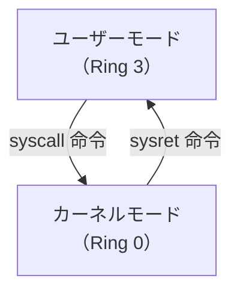

`v5` ではシステムコールの仕組みを深く理解します。
v1 で使った `sys_exit` に加え、`sys_write` でデータを出力し、カーネルとの対話を体験します。

## 概要

`v5` はシステムコールの仕組みを深く理解する段階です。sys_write による stdout/stderr への出力を通じて、syscall 呼び出し規約（レジスタの割り当てと戻り値）、ユーザーモードとカーネルモードの境界を学びます。

## この段階で押さえること

- syscall 呼び出し規約（レジスタの役割）
- ユーザーモードとカーネルモードの境界
- なぜ syscall が必要なのか
- syscall の戻り値が rax を上書きすること

## syscall と libc 関数の違い

UNIX 系の資料を読むと `write(2)` や `printf(3)` のような C ライブラリ関数と、アセンブリの `syscall` が混ざって見えることがあります。ここは層を分けて理解すると迷いません。

- **syscall** — CPU 命令。ユーザーモードからカーネルモードへ入る入口そのもの
- **`write(2)`** — libc から呼べる関数インターフェース。内部で `syscall` を使って `sys_write` へつなぐ
- **`printf(3)`** — 書式展開まで含むさらに高水準な関数。最終的には `write` 系へ落ちる

この章で学ぶのは一番下の層です。`mov rax, 1`、`mov rdi, 1`、`syscall` と自分で並べることで、普段 C や Rust が隠してくれている「カーネルへの入り口」が見えるようになります。

## Syscall 呼び出し規約

x86-64 Linux では、`syscall` 命令を使ってカーネルの機能を呼び出します。
レジスタの割り当ては以下の通りです：

| レジスタ | 役割 |
|----------|------|
| `rax` | システムコール番号 |
| `rdi` | 第 1 引数 |
| `rsi` | 第 2 引数 |
| `rdx` | 第 3 引数 |
| `r10` | 第 4 引数 |
| `r8` | 第 5 引数 |
| `r9` | 第 6 引数 |
| **戻り値** | **`rax` に格納される** |

### syscall で破壊されるレジスタ

`syscall` 命令は以下のレジスタを **CPU が自動的に上書き** します：

- `rcx` ← 戻りアドレス（syscall 直後の RIP）
- `r11` ← RFLAGS の値

これらは syscall の「副作用」であり、プログラマが明示的にセットするものではありません。

## ユーザーモード vs カーネルモード

CPU には少なくとも 2 つの動作モードがあります：



- **ユーザーモード**: 通常のプログラムが実行されるモード。ハードウェアに直接アクセスできない
- **カーネルモード**: OS カーネルが実行されるモード。すべてのハードウェアにアクセス可能

`syscall` 命令を実行すると、CPU は以下を行います：
1. 現在の RIP を `rcx` に保存
2. 現在の RFLAGS を `r11` に保存
3. LSTAR MSR レジスタに登録されたカーネルのエントリポイントに RIP をセット
4. 特権レベルを Ring 0 に変更

## なぜ syscall が存在するか

プログラムがハードウェアに直接アクセスできると：
- 他のプログラムのメモリを読み書きできてしまう
- ディスクの内容を破壊できてしまう
- 他のプロセスの I/O を横取りできてしまう

**カーネルが仲介者** となることで、安全性を保ちます。プログラムは「ファイルに書き込みたい」「メモリを確保したい」とカーネルに依頼し、カーネルが権限を確認してから実行します。

## sys_write — データを出力する

| 引数 | レジスタ | 値 |
|------|---------|-----|
| syscall# | rax | 1 (sys_write) |
| fd | rdi | 1=stdout, 2=stderr |
| buf | rsi | 書き込むデータのアドレス |
| count | rdx | 書き込むバイト数 |
| **戻り値** | **rax** | 書き込まれたバイト数 |

## stdout と stderr

プロセスには最初から 3 つのファイルディスクリプタが開いています：

| fd | 名前 | 用途 |
|----|------|------|
| 0 | stdin | 標準入力 |
| 1 | stdout | 標準出力 |
| 2 | stderr | 標準エラー出力 |

`hello.asm` は fd=1（stdout）に書き込み、`write_stderr.asm` は fd=2（stderr）に書き込みます。
端末上では両方とも画面に表示されますが、リダイレクトで区別できます：

```bash
./hello > /dev/null     # stdout を捨てる → 何も表示されない
./write_stderr > /dev/null  # stdout を捨てる → stderr は表示される
```

## rax が戻り値で上書きされる

`multi_syscall.asm` の重要なポイント：

```nasm
mov rax, 1      ; rax = 1 (sys_write)
; ... (引数セット)
syscall          ; sys_write 実行後、rax = 書き込んだバイト数
; この時点で rax はもう 1 ではない！
mov rax, 60     ; 次の syscall のために rax を再セット
```

syscall は常に rax を戻り値で上書きします。次の syscall を呼ぶ前に、rax にシステムコール番号を再セットする必要があります。

## プレビュー: カーネルに入る他の方法

syscall は **同期的・自発的** なカーネル遷移です。プログラムが意図的にカーネルを呼び出します。

カーネルに入る方法は他にもあります：
- **割り込み (interrupt)** — 外部デバイスからの非同期通知（キーボード、タイマーなど）
- **例外 (exception)** — 不正なメモリアクセス（SIGSEGV）やゼロ除算など

これらは v9 以降で学びます。

## ソースコード

{{code:asm/hello.asm}}

{{code:asm/write_stderr.asm}}

{{code:asm/multi_syscall.asm}}

## 参考文献

本章の技術的記述は以下の一次資料に基づいています。

- [Intel SDM Vol.2 SYSCALL](https://www.felixcloutier.com/x86/syscall) — RCX←RIP, R11←RFLAGS, RIP←IA32_LSTAR の動作
- [Intel SDM Vol.3 Ch.5 "Protection"](https://www.intel.com/content/www/us/en/developer/articles/technical/intel-sdm.html) — Ring 0〜3 の特権レベル定義
- [`syscall(2)` man page](https://man7.org/linux/man-pages/man2/syscall.2.html) — x86-64 Linux の syscall 呼び出し規約: rax=番号, rdi/rsi/rdx/r10/r8/r9=引数
- [Linux kernel `syscall_64.tbl`](https://github.com/torvalds/linux/blob/master/arch/x86/entry/syscalls/syscall_64.tbl) — sys_write=1, sys_exit=60
