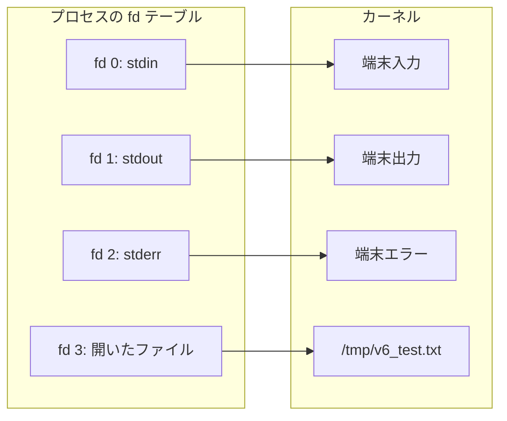
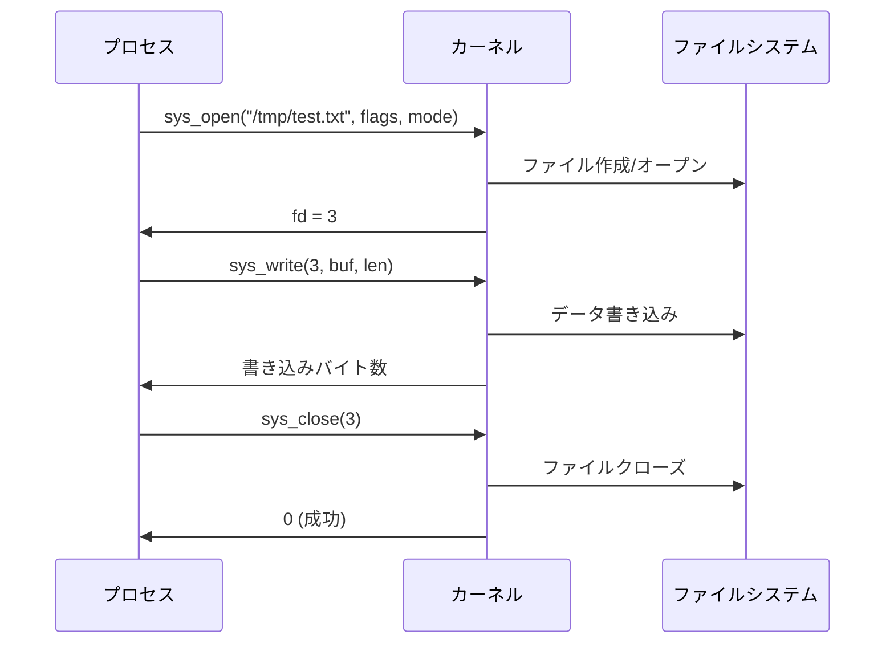

`v6` ではファイルディスクリプタと I/O を学びます。
v5 で学んだ syscall を使って、ファイルの読み書きを行い、UNIX の I/O モデルを体験します。

## 概要

`v6` はファイルディスクリプタと I/O を扱う段階です。sys_read/sys_write/sys_open/sys_close を使ってファイルの読み書きを行い、fd テーブル、.bss セクション、"Everything is a file" の概念を学びます。

## この段階で押さえること

- ファイルディスクリプタ（fd）はカーネルオブジェクトへの参照番号
- stdin=0, stdout=1, stderr=2 は最初から開かれている
- `sys_read` / `sys_write` / `sys_open` / `sys_close` の使い方
- `.bss` セクション: 未初期化データ領域
- "Everything is a file" — UNIX の設計哲学

## ファイルディスクリプタ

ファイルディスクリプタ（fd）は、プロセスがカーネルオブジェクトを参照するための **整数** です。



新しいファイルを `sys_open` で開くと、空いている最小の fd 番号が割り当てられます。
stdin=0, stdout=1, stderr=2 が既に使われているので、最初に開いたファイルは **fd=3** になります。

## file descriptor と `FILE*` の違い

C を触ったことがあると、`FILE*` と fd を同じものだと感じやすいですが、実際には層が異なります。

- **fd** — カーネルが管理する整数ハンドル。`read` / `write` / `open` / `close` の対象
- **`FILE*`** — libc が提供する高水準ストリーム。内部にバッファや書式化の都合を持つ

`stdin`, `stdout`, `stderr` という名前も、最終的には fd 0, 1, 2 に対応します。ただし C の `fopen` や `fprintf` を使うと、裏側で `FILE*` のバッファリングや整形処理が走ります。この章ではそこを 1 段剥がして、**整数 fd と syscall だけで I/O を操作する** 見方に慣れるのが目的です。

## "Everything is a file"

UNIX の設計哲学の根幹です：
- ファイル → fd + read/write
- パイプ → fd + read/write
- ソケット → fd + read/write
- デバイス → fd + read/write

すべてが同じ `read`/`write` インターフェースで操作できます。この統一性が UNIX の強みです。

## syscall 番号表

| 番号 | 名前 | rdi | rsi | rdx | 戻り値 |
|------|------|-----|-----|-----|--------|
| 0 | sys_read | fd | buf | count | 読み取りバイト数 |
| 1 | sys_write | fd | buf | count | 書き込みバイト数 |
| 2 | sys_open | pathname | flags | mode | fd |
| 3 | sys_close | fd | — | — | 0 (成功) |
| 60 | sys_exit | status | — | — | — |

## .bss セクション

`.bss` セクションは **未初期化データ** の領域です。ゼロで初期化されることが保証されています。

```nasm
section .bss
    buf: resb 16       ; 16 バイトを確保（reserve bytes）
```

| 擬似命令 | サイズ | 説明 |
|---------|-------|------|
| `resb N` | N バイト | reserve bytes |
| `resw N` | N×2 バイト | reserve words |
| `resd N` | N×4 バイト | reserve double-words |
| `resq N` | N×8 バイト | reserve quad-words |

`.data` セクションとの違い：
- `.data` — 初期値あり。実行ファイルにデータが含まれる
- `.bss` — 初期値なし。実行ファイルにはサイズ情報のみ（ファイルが小さくなる）

## sys_open のフラグ

ファイルを開くとき、フラグをビット OR で組み合わせます：

| フラグ | 値 | 意味 |
|--------|-----|------|
| O_RDONLY | 0 | 読み取り専用 |
| O_WRONLY | 1 | 書き込み専用 |
| O_CREAT | 64 (0x40) | ファイルが存在しなければ作成 |
| O_TRUNC | 512 (0x200) | 既存の内容を切り詰め |

```
O_WRONLY | O_CREAT | O_TRUNC = 1 | 64 | 512 = 577
```

ビット OR によるフラグの組み合わせは、カーネル API で広く使われるパターンです（v8 の mmap フラグと同じ考え方）。

## open → write → close ライフサイクル

ファイル I/O の基本パターン：



## エコーバック: read → write

`read_stdin.asm` は stdin から読んだデータをそのまま stdout に書き戻します。

```
echo "hello" | ./read_stdin
```

パイプ（`|`）でつなぐと、左のコマンドの stdout が右のコマンドの stdin に接続されます。
これも fd の仕組み — "Everything is a file" の実例です。

## ソースコード

{{code:asm/read_stdin.asm}}

{{code:asm/write_file.asm}}

{{code:asm/fd_table.asm}}

## 参考文献

本章の技術的記述は以下の一次資料に基づいています。

- [POSIX.1-2017 `<unistd.h>`](https://pubs.opengroup.org/onlinepubs/9699919799/functions/stdin.html) — STDIN_FILENO=0, STDOUT_FILENO=1, STDERR_FILENO=2
- [Linux kernel `syscall_64.tbl`](https://github.com/torvalds/linux/blob/master/arch/x86/entry/syscalls/syscall_64.tbl) — sys_read=0, sys_write=1, sys_open=2, sys_close=3
- [glibc `bits/fcntl-linux.h`](https://github.com/bminor/glibc/blob/master/sysdeps/unix/sysv/linux/bits/fcntl-linux.h) — O_WRONLY=1, O_CREAT=0100(8進)=64, O_TRUNC=01000(8進)=512
- [ELF Specification (System V ABI)](https://refspecs.linuxfoundation.org/LSB_1.1.0/gLSB/specialsections.html) — `.bss` セクションのゼロ初期化保証
- [NASM Manual §3.2](https://www.nasm.us/doc/nasmdoc3.html) — `resb`/`resw`/`resd`/`resq` による領域確保
